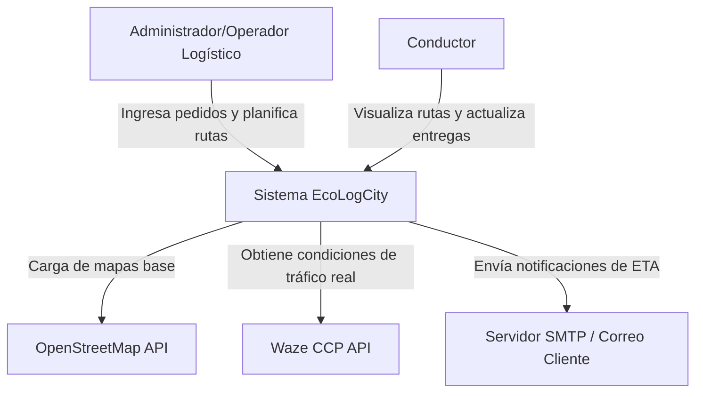
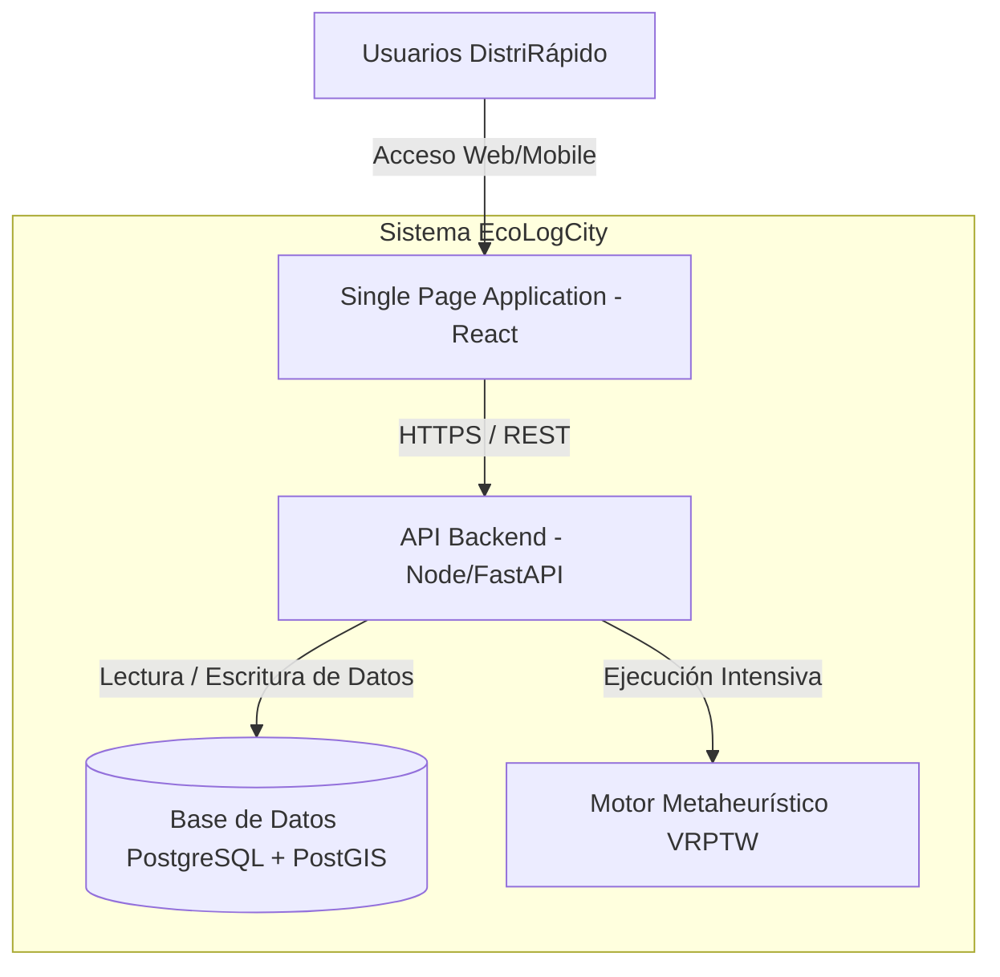
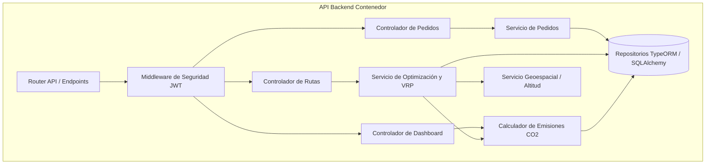

# Documento 07: Arquitectura de Software - Modelo C4

## Nivel 1: Diagrama de Contexto

El diagrama de contexto ilustra cómo los usuarios interactúan con EcoLogCity y cómo este se integra con los sistemas de terceros para cumplir su objetivo.

## Nivel 2: Diagrama de Contenedores

Este diagrama detalla los contenedores principales de la plataforma web.

## Nivel 3: Diagrama de Componentes

Detalle interno del contenedor principal (API Backend), mostrando la segregación de responsabilidades.

