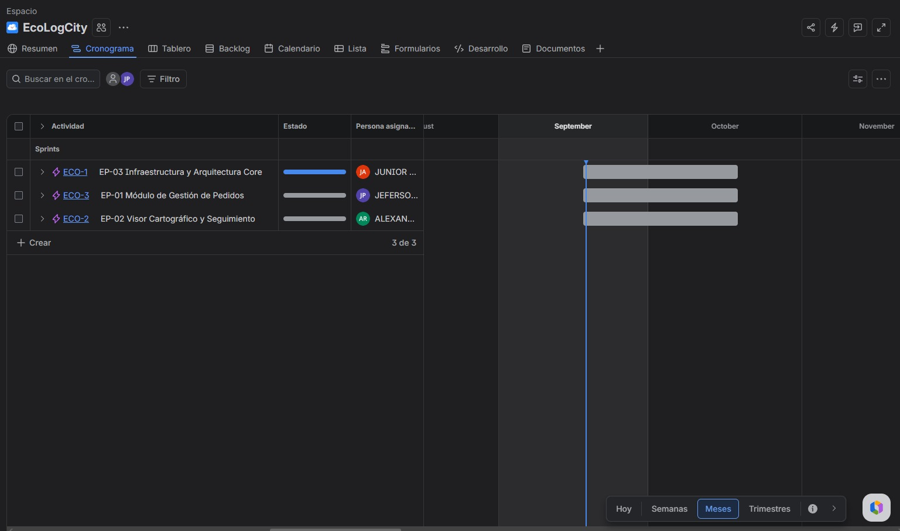
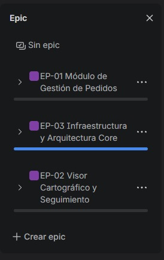
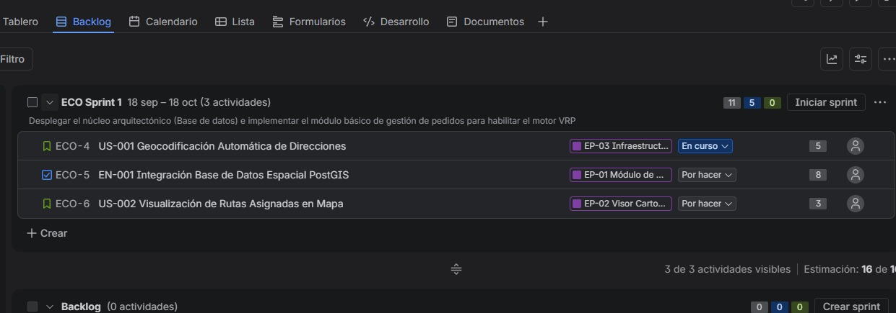
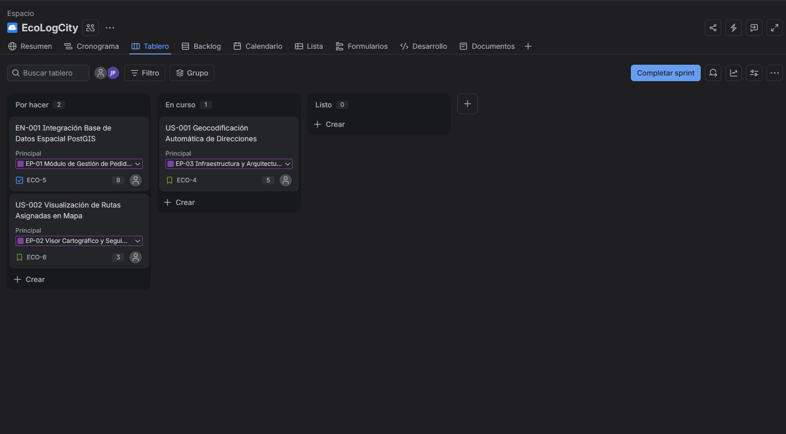

# Documento 02: Artefactos Jira

[← Volver al README Principal](../../README.md)

Este documento centraliza las evidencias de la configuración y gestión del proyecto en Atlassian Jira Software, evidenciando el cumplimiento del marco Scrum.

*(Nota para la exposición: En este documento se deben reemplazar los placeholders de imágenes por las capturas de pantalla reales, recortadas estrictamente a los paneles de Jira según la directiva académica).*

## Evidencia 1: Roadmap del Proyecto
Se estructuraron las Épicas en una línea temporal (Timeline/Roadmap), visualizando los bloques de trabajo principales (ej. Gestión de Pedidos, Motor VRP, Visor Cartográfico) a lo largo de los sprints definidos.

## Evidencia 2: Backlog Priorizado
El Backlog fue priorizado considerando el valor de negocio y el riesgo arquitectónico (el núcleo del motor VRP primero). Se ha estimado el esfuerzo utilizando Story Points (secuencia Fibonacci: 1, 2, 3, 5, 8, 13) y cada historia fue vinculada a su Épica correspondiente.

## Evidencia 3: Sprint Planning & Sprint Goal
Se ejecutó la planificación del Sprint 1, asignándole una duración estandarizada de 2 semanas (14 días).
**Sprint Goal:** "Desplegar el núcleo arquitectónico (Base de datos e Infraestructura CI/CD) e implementar el módulo básico de gestión y geocodificación de pedidos para habilitar los insumos del motor VRP."

## Evidencia 4: Tablero Scrum Activo
El Tablero (Board) de Jira fue configurado para reflejar nuestro flujo de trabajo ágil. Contiene estrictamente las columnas: `To Do` → `In Progress` → `In Review / QA` → `Done`.

## Evidencia 5: Gestión de Versiones / Release
Se creó una versión en el módulo de Releases de Jira denominada `v1.0.0-MVP` (Minimum Viable Product). Las historias de usuario y épicas completadas en el marco del primer release se encuentran etiquetadas hacia esta versión.

[← Volver al README Principal](../../README.md)
